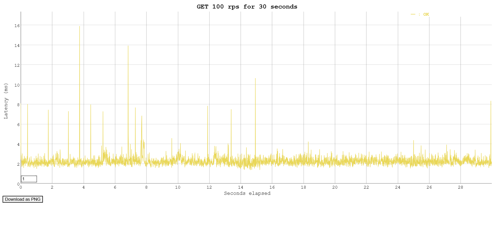

# [WB Техношкола](https://tech.wildberries.ru). Задание L0
Демонстрационный сервис с простейшим интерфейсом, отображающий данные о заказе.
## Features
* Получение информации о заказе
## Requirements
* Docker
## Installation
1. Клонировать репозиторий
```
git clone https://github.com/Lesion45/l0-wb.git
cd l0-wb
```
2. Запустить Makefile:
```
make start
```
## Configuration
Необходимо создать файл `secrets.env` со следующей структурой:
```
ENV=dev # options: dev, prod

POSTGRES_USER=user
POSTGRES_PASSWORD=pass
POSTGRES_DB=db
POSTGRES_DSN=postgres://${POSTGRES_USER}:${POSTGRES_PASSWORD}@db:5432/${POSTGRES_DB}

ZOOKEEPER_CLIENT_PORT: 2181

KAFKA_ADVERTISED_LISTENERS=PLAINTEXT://kafka:9092
KAFKA_LISTENERS=PLAINTEXT://0.0.0.0:9092
KAFKA_ZOOKEEPER_CONNECT=zookeeper:2181

BROKER_HOST=kafka:9092
BROKER_TOPIC=orders

GOOSE_DRIVER=postgres
GOOSE_DBSTRING=${POSTGRES_DSN}?sslmode=disable
```
## Usage
### Получение информации о заказе
Endpoint: `api/v1/get_order`, Method: `GET`, Content-type: `application/json`
#### Request
```
curl --location --request GET 'http://localhost:3000/api/v1/get_order' \
--header 'Content-Type: application/json' \
--data-raw '{ \
    "order_uid": "b563feb7b2b84b6test"
}'
```
#### Response
```
{
   "order_uid": "b563feb7b2b84b6test",
   "track_number": "WBILMTESTTRACK",
   "entry": "WBIL",
   "delivery": {
      "name": "Test Testov",
      "phone": "+9720000000",
      "zip": "2639809",
      "city": "Kiryat Mozkin",
      "address": "Ploshad Mira 15",
      "region": "Kraiot",
      "email": "test@gmail.com"
   },
   "payment": {
      "transaction": "b563feb7b2b84b6test",
      "request_id": "",
      "currency": "USD",
      "provider": "wbpay",
      "amount": 1817,
      "payment_dt": 1637907727,
      "bank": "alpha",
      "delivery_cost": 1500,
      "goods_total": 317,
      "custom_fee": 0
   },
   "items": [
      {
         "chrt_id": 9934930,
         "track_number": "WBILMTESTTRACK",
         "price": 453,
         "rid": "ab4219087a764ae0btest",
         "name": "Mascaras",
         "sale": 30,
         "size": "0",
         "total_price": 317,
         "nm_id": 2389212,
         "brand": "Vivienne Sabo",
         "status": 202
      }
   ],
   "locale": "en",
   "internal_signature": "",
   "customer_id": "test",
   "delivery_service": "meest",
   "shardkey": "9",
   "sm_id": 99,
   "date_created": "2021-11-26T06:22:19Z",
   "oof_shard": "1"
}
```
## Benchmarks
Бенчмарк проводился при помощи утилиты Vegeta и выдал следующие результаты



## Author
* [Lesion45](https://github.com/Lesion45)